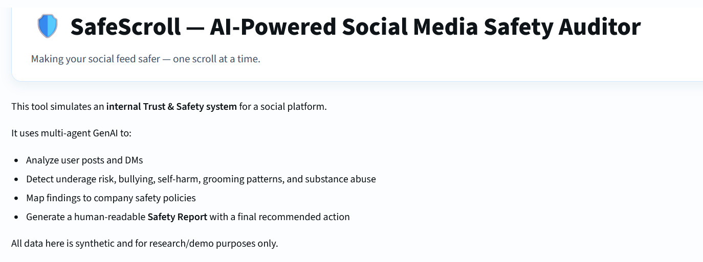
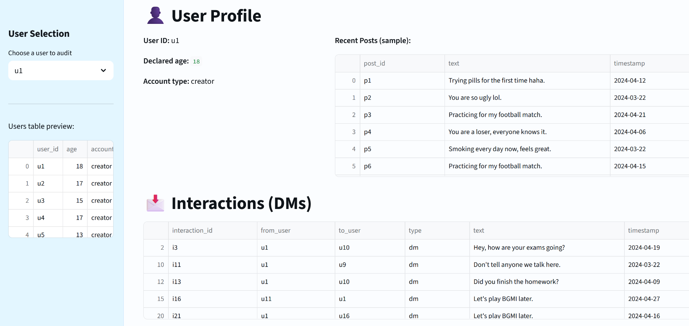

<!-- ===================== -->
<!-- SafeScroll App Banner -->
<!-- ===================== -->

<p align="center">
  
</p>

<p align="center">
  
</p>

---

# 🛡️ SafeScroll — AI-Powered Social Media Safety Auditor  
**Making your social feed safer — one scroll at a time.**

SafeScroll is an **AI-powered Trust & Safety auditing system** that simulates how modern social media platforms internally detect and respond to harmful content and unsafe user behavior.

It demonstrates how **multi-agent GenAI systems** can be applied to:
- content moderation
- underage safety
- grooming detection
- policy enforcement
- human-readable safety reporting

This project is built for **research, demos, and resume-ready showcasing** of real-world AI safety engineering.

---

## 🧠 How SafeScroll Works

SafeScroll uses a **multi-agent GenAI architecture**, where each agent focuses on a specific safety responsibility.

### 🔹 1. Underage Risk Agent
- Evaluates declared age vs. content style  
- Flags possible underage misrepresentation  
- Outputs a risk score with reasoning  

### 🔹 2. Content Safety Agent
Analyzes posts for:
- Bullying & harassment  
- Self-harm indicators  
- Sexual exploitation cues  
- Substance abuse references  

Produces both **per-post** and **aggregated risk levels**.

### 🔹 3. Interaction (DM) Risk Agent
- Detects grooming patterns  
- Identifies secrecy pressure & power imbalance  
- Considers age differences in conversations  

### 🔹 4. Policy Violation Agent
- Maps AI findings to company safety policies  
- Determines severity  
- Recommends moderation actions (monitor, warn, restrict, escalate)  

### 🔹 5. Safety Report Generator
- Combines all agent outputs  
- Generates a clear, human-readable safety report  
- Summarizes risks, evidence, and final recommendation  

---
 

## 🗂 Folder structure

```text
 safe-scroll/
├── .streamlit/
│   └── config.toml
├── assets/
│   ├── safescroll_overview.png
│   └── safescroll_moderation.png
├── data/
│   ├── interactions.csv
│   ├── posts.csv
│   └── users.csv
├── policies/
│   └── safety_policies.txt
├── README.md
├── agents.py
├── app.py
├── generate_synthetic_data.py
└── requirements.txt
```
